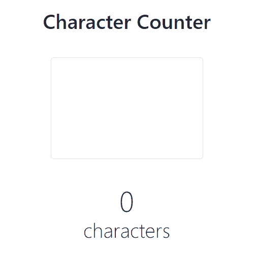

# Character Counter

A simple character counting application built with  **HTML** ,  **CSS** ,  **JavaScript** , and  **Bootstrap 5.3** . Users can input text, and the app dynamically displays the number of characters entered.

---

## Preview

### Features

* **Real-time Updates** : The character count updates as the user types.
* **Responsive Design** : Built with Bootstrap for adaptability across devices.
